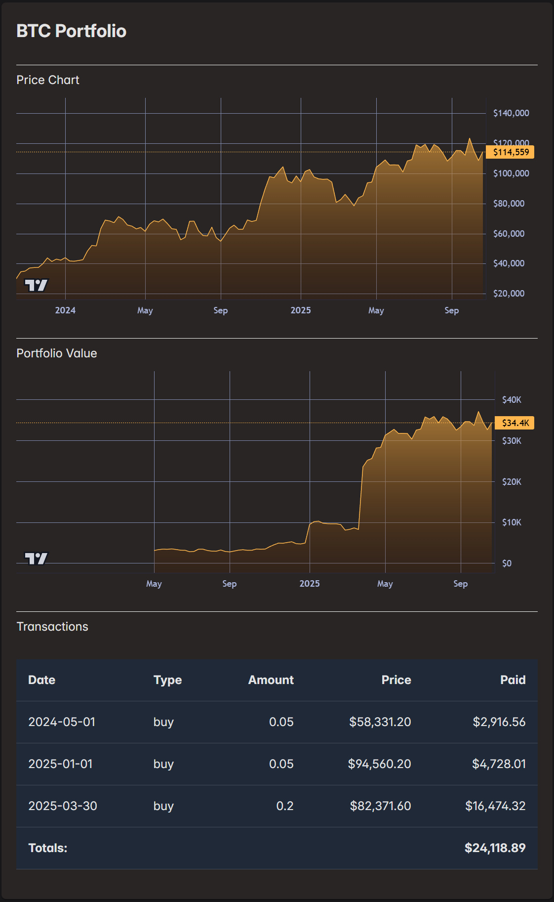
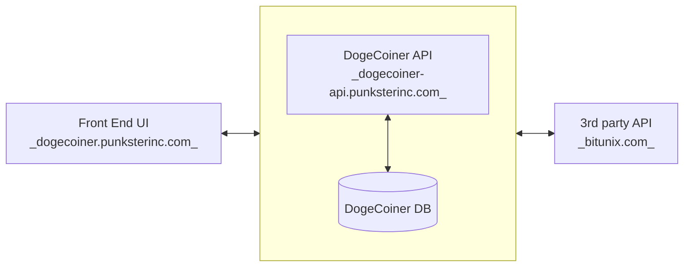
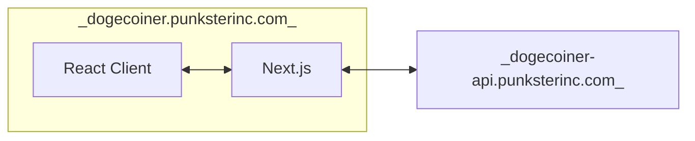
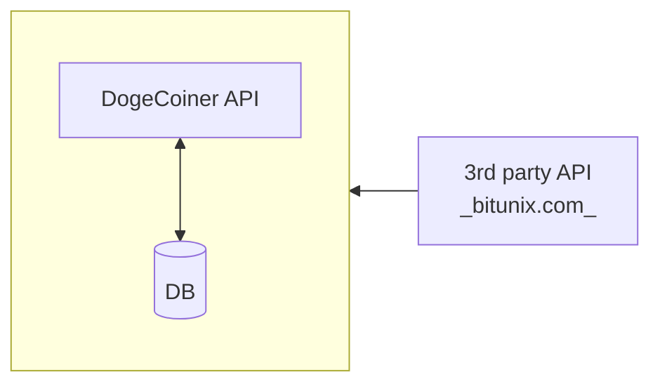
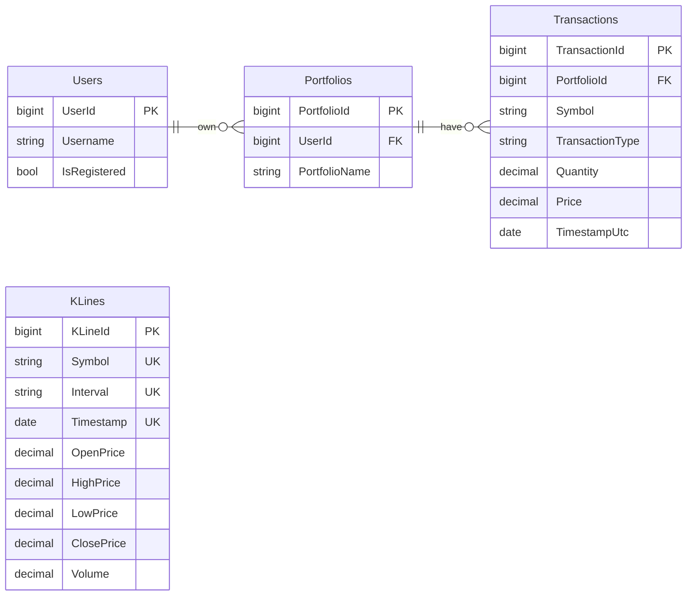

# Punkster Inc Technical Documentation

This site provides internal architecture and application overview for Punkster's financial apps.

## DogeCoiner IO

This is a crypto portfolio management app.

<figure markdown="span">
[Live Demo](https://dogecoiner.punksterinc.com){:target="_blank" .md-button }
</figure>

<figure markdown="span">
{ style="width:500px;" }
</figure>

It's split up into the following client/server sub-systems.

This is an evolving platform that I deploy publicly as I make progress.

So far I've built out some end to end infrastructure deployed to these subdomains:

- **dogecoiner-api.punksterinc.com** - A working Asp.Net API that serves historical price data from my own DB.
- **dogecoiner.punksterinc.com** - A front end that uses the lightweight TradingView chart control for basic charting of crypto price data and simple portfolio data. I toggle code for API connectivity, relying more on dummy data until I build out more of the UI.

The different subsystems are detailed below.

### DogeCoiner-UI

This is a responsive React front end for creating and tracking portfolios.

This is also its own client/server stack using Next.js.

This allows for

- improved API security 

    * the client only talks to the Next.js Node API simplifying CORS
    * the Next.js Node server securely connects to the DogeCoiner API

- smaller client payloads 
- and optimized SSR features
  
    * Next.js basically works like an Asp.Net SSR Razor web app, but with full benefits of SPA development

Since it's a full client/server on its own, I've opted to deploy the front end to its own subdomain.

<figure markdown="span">
[UI Repo](https://github.com/abardandev/dogecoiner-ui){:target="_blank" .md-button}
</figure>

### DogeCoiner-API

This is an API for serving crypto price history and user portfolio data. 

So far, it can serve price history.

My app needs historical crypto price data. There are various free and paid 3rd party APIs that can provide it in real-time, with trading platforms usually having their own public APIs. For anything other than current real-time prices, historical price data is static after it's generated in the market. So I opt to store my own price history that I update periodically from 3rd party APIs. I'm currently getting price data from the Bitunix exchange public API.

<figure markdown="span">
[API Repo](https://github.com/abardandev/dogecoiner-api){:target="_blank" .md-button}
</figure>

### DogeCoiner-DB

This is the database that stores crypto price history and user portfolios.

DogeCoiner DB Schema

<figure markdown="span">
[DB Repo](https://github.com/abardandev/dogecoiner-db){:target="_blank" .md-button}
</figure>